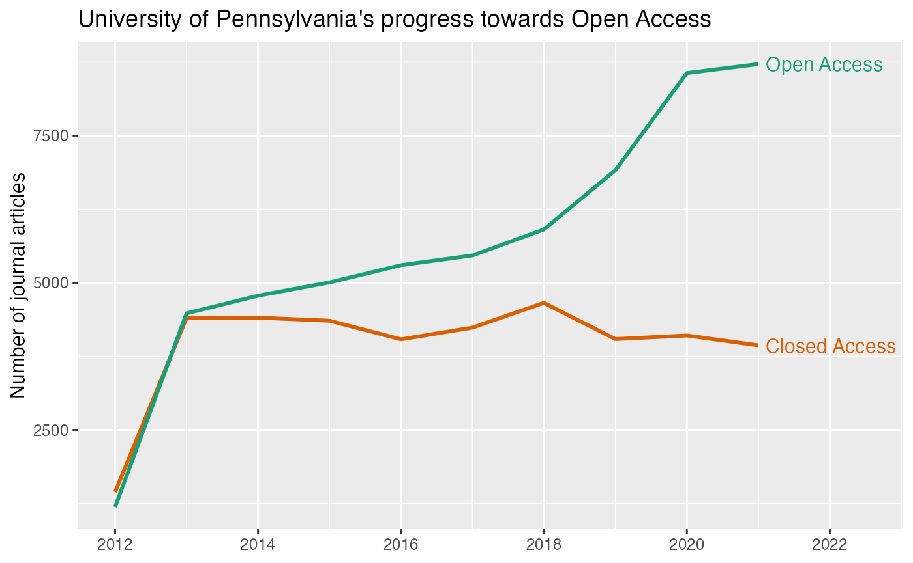

# Transition towards Open Access

Following the template in OpenAlex’s [oa-percentage
tutorial](https://github.com/ourresearch/openalex-api-tutorials/blob/develop/notebooks/institutions/oa-percentage.ipynb),
this vignette uses openalexR to answer:

**How many of recent journal articles from the University of
Pennsylvania are open access? And how many aren’t?**

``` r

library(openalexR)
library(dplyr)
library(tidyr)
library(ggplot2)
```

We first need to find the
[openalex.id](https://developers.openalex.org/guides/get) for University
of Pennsylvania. We can do this by fetching for the *institutions*
`entity` and put *“University of Pennsylvania”* in `display_name` or
`display_name.search`:

``` r

oa_fetch(
  entity = "inst", # same as "institutions"
  display_name.search = "\"University of Pennsylvania\""
) %>%
  select(display_name, ror) %>% 
  knitr::kable()
```

| display_name                               | ror                         |
|:-------------------------------------------|:----------------------------|
| University of Pennsylvania                 | <https://ror.org/00b30xv10> |
| California University of Pennsylvania      | <https://ror.org/01spssf70> |
| Hospital of the University of Pennsylvania | <https://ror.org/02917wp91> |
| University of Pennsylvania Health System   | <https://ror.org/04h81rw26> |
| Indiana University of Pennsylvania         | <https://ror.org/0511cmw96> |
| University of Pennsylvania Press           | <https://ror.org/03xwa9562> |
| Cheyney University of Pennsylvania         | <https://ror.org/02nckwn80> |

We will use the first ror, [00b30xv10](https://ror.org/00b30xv10), as
one of the filters for our query.

***Alternatively***, we could go to the autocomplete endpoint at
<https://explore.openalex.org/> to search for “University of
Pennsylvania” and find the ror
[there](https://explore.openalex.org/institutions/I79576946)!

All other filters are straightforward and explained in detail in the
original jupyter notebook
[tutorial](https://github.com/ourresearch/openalex-api-tutorials/blob/develop/notebooks/institutions/oa-percentage.ipynb).
The only difference here is that, instead of grouping by `is_oa`, we’re
interested in the “trend” over the years, so we’re going to group by
`publication_year`, and perform the query twice, one for
`is_oa = "true"` and one for `is_oa = "false"` .

``` r

open_access <- oa_fetch(
  entity = "works",
  institutions.ror = "00b30xv10",
  type = "article",
  from_publication_date = "2012-08-24",
  is_paratext = "false",
  is_oa = "true",
  group_by = "publication_year"
)

closed_access <- oa_fetch(
  entity = "works",
  institutions.ror = "00b30xv10",
  type = "article",
  from_publication_date = "2012-08-24",
  is_paratext = "false",
  is_oa = "false",
  group_by = "publication_year"
)

uf_df <- closed_access %>%
  select(- key_display_name) %>%
  full_join(open_access, by = "key", suffix = c("_ca", "_oa")) 

uf_df
#>     key count_ca key_display_name count_oa
#> 1  2018     4659             2018     5906
#> 2  2014     4407             2014     4780
#> 3  2013     4403             2013     4481
#> 4  2015     4355             2015     5006
#> 5  2017     4238             2017     5464
#> 6  2020     4104             2020     8564
#> 7  2019     4043             2019     6912
#> 8  2016     4039             2016     5299
#> 9  2022     3943             2022     8121
#> 10 2021     3937             2021     8716
#> 11 2024     3443             2024     8599
#> 12 2025     3315             2025     8624
#> 13 2023     3234             2023     8814
#> 14 2026     2552             2026     5031
#> 15 2012     1444             2012     1189
```

Finally, we compare the number of open vs. closed access articles over
the years:

``` r

uf_df %>%
  filter(key <= 2021) %>% # we do not yet have complete data for 2022 and after
  pivot_longer(cols = starts_with("count")) %>%
  mutate(
    year = as.integer(key),
    is_oa = recode(
      name,
      "count_ca" = "Closed Access",
      "count_oa" = "Open Access"
    ),
    label = if_else(key < 2021, NA_character_, is_oa)
  ) %>% 
  select(year, value, is_oa, label) %>%
  ggplot(aes(x = year, y = value, group = is_oa, color = is_oa)) +
  geom_line(size = 1) +
  labs(
    title = "University of Pennsylvania's progress towards Open Access",
    x = NULL, y = "Number of journal articles") +
  scale_color_brewer(palette = "Dark2", direction = -1) +
  scale_x_continuous(breaks = seq(2010, 2024, 2)) +
  geom_text(aes(label = label), nudge_x = 0.1, hjust = 0) +
  coord_cartesian(xlim = c(NA, 2022.5)) +
  guides(color = "none")
```



plot of chunk oa-trend
